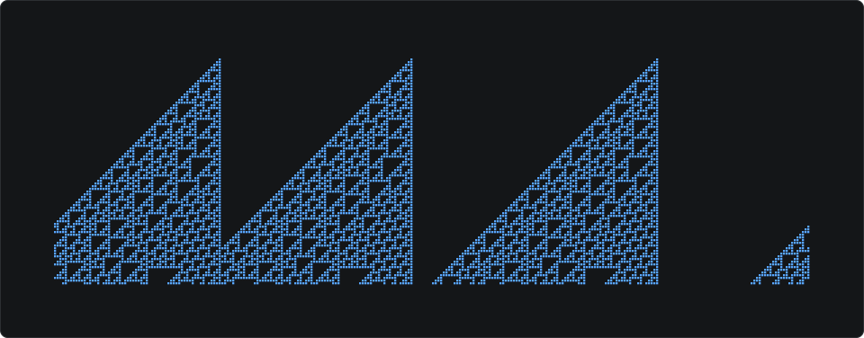

# Amirali Amirifar

I'm a software engineer based in Tehran, working on distributed systems and storage infrastructure, mainly in Go.

I'm currently pursuing an MSc in AI at the University of Tehran, following a BSc in computer science at Sharif University Of Technology.

[Website](https://amirifar.me) · [LinkedIn](https://www.linkedin.com/in/amirali-amirifar/) · [Email](mailto:amirali.amirifar@gmail.com)

### Highlights

- Designed and implemented a distributed orchestration platform using PostgreSQL, NATS, ClickHouse, and object storage.
- Built transactional storage quotas covering concurrent uploads, reservations, recursive filesystem operations, and crash recovery.
- Built a PostgreSQL migration engine with live replication to reduce read-only downtime during schema changes.
- Investigating error spikes and spectral bias in time-series foundation models through controlled perturbations and adversarial evaluation.

I also contribute to open source projects whenever I can, including NATS [#8538](https://github.com/nats-io/nats-server/pull/8538) and websockets/ws [#2285](https://github.com/websockets/ws/pull/2285).

### Selected projects

- [Refusal directions on Qwen](https://github.com/Amirali-Amirifar/refusal-direction-qwen-mps): reproduced a mechanistic interpretability experiment on Apple Silicon, with a local pipeline for ablation and evaluation.
- [Decaf](https://github.com/Amirali-Amirifar/decaf): a Mini Java to C compiler with parsing, semantic analysis, and virtual method dispatch.

### Tech Stack

Tools I've used at work and in projects.

Languages & frameworks

Data & messaging

Infrastructure

AI

### Daily Art

Daily patterns from [elementary cellular automata](https://en.wikipedia.org/wiki/Elementary_cellular_automaton).

<picture>
  <source media="(prefers-color-scheme: dark)" srcset="assets/daily.svg">
  <source media="(prefers-color-scheme: light)" srcset="assets/daily-light.svg">
  
</picture>

Rule 110 · 2026-09-23 (UTC) · [Source](scripts/update_readme.py)
